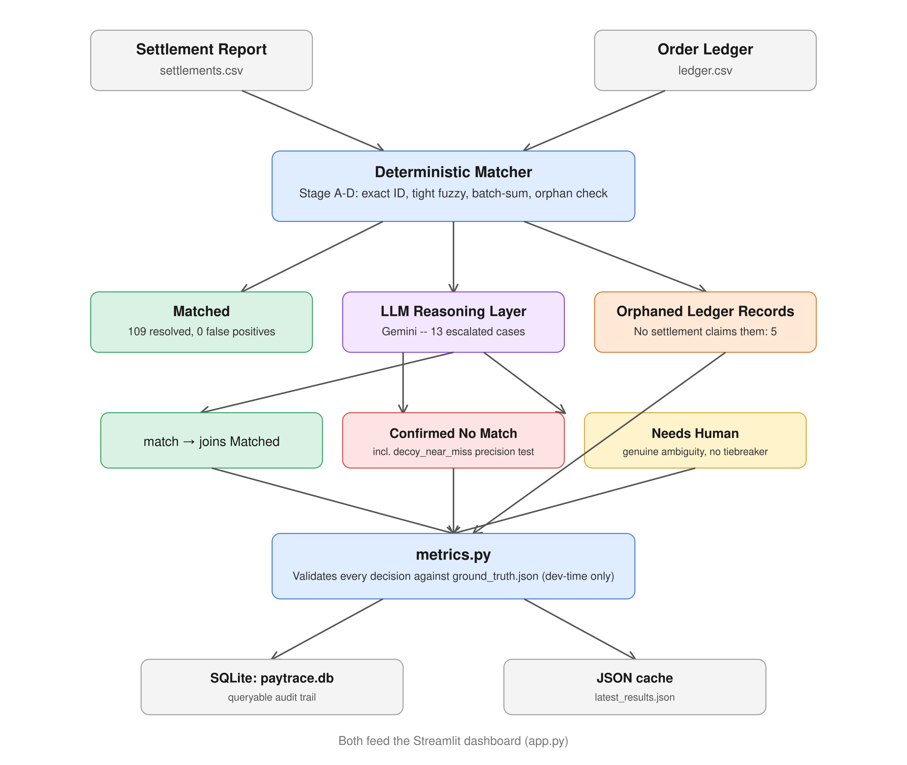

# Architecture


## Why it's built this way

**Deterministic first, LLM only where necessary.** The deterministic layer
resolves 109 of 122 settlements (89%) cheaply and safely, using an
absolute-tolerance fuzzy match rather than "closest available candidate" --
this is the specific fix for a real bug found in testing, where a loose
tolerance let a coincidentally-close decoy pair get falsely matched. Only
the genuinely ambiguous remainder reaches the LLM, which keeps API usage
small (10-13 calls total, not 122) and keeps the AI's role meaningful --
real judgment on hard cases, not narration over rules already decided.

**No separate backend.** Streamlit calls the Python pipeline directly,
in-process. Nothing else needs to call this system over HTTP, so an API
server would add process/networking complexity for no benefit.

**Validation is a first-class component, not an afterthought.**
`metrics.py` doesn't just report a match rate -- every decision, from
either layer, gets checked against `ground_truth.json` (a dev-time-only
hidden answer key, never seen by the matcher itself). This is what
caught every real bug in this project's build log: a tolerance set too
loose, candidates leaking between unrelated settlements, a comma-parsing
bug that created false positives, and a case where the LLM guessed
correctly but for no justifiable reason (flagged `OVERCONFIDENT` even
though the final answer happened to be right).

**Two persistence paths, deliberately redundant.** `metrics.py` writes
both a JSON cache (fast, simple, what the dashboard reads) and a SQLite
database (a real, queryable audit trail a judge could open directly and
run `SELECT * FROM match_results WHERE bucket = 'confirmed_no_match'`
against). Neither replaces the other; both exist because they serve
different audiences.

## File-to-component map

```
data/settlements.csv, ledger.csv   Synthetic source data (11 deliberate
                                     messiness categories -- see README)
data/ground_truth.json              Hidden answer key -- DEV-TIME ONLY,
                                     never seen by the matcher or the LLM

src/schema.py                       SettlementRecord, LedgerRecord, GroundTruthLabel
src/generate_data.py                Builds the synthetic dataset
src/deterministic_matcher.py        Stage A-D: exact ID match, tight fuzzy
                                     match, many-to-one batch detection,
                                     orphan detection -- resolves the
                                     confident majority cheaply
src/llm_matcher.py                  Agentic layer (Gemini) -- real judgment
                                     calls on whatever the deterministic
                                     layer explicitly refused to guess on:
                                     match / no_match / needs_human
src/metrics.py                      Combines both layers, computes match
                                     rate + categorized exception list,
                                     validates every decision against
                                     ground truth
src/db.py                           SQLite persistence -- a real, queryable
                                     audit trail
app.py                              Streamlit dashboard
```